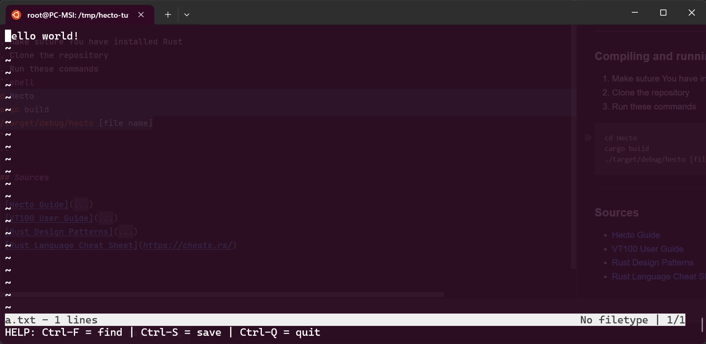
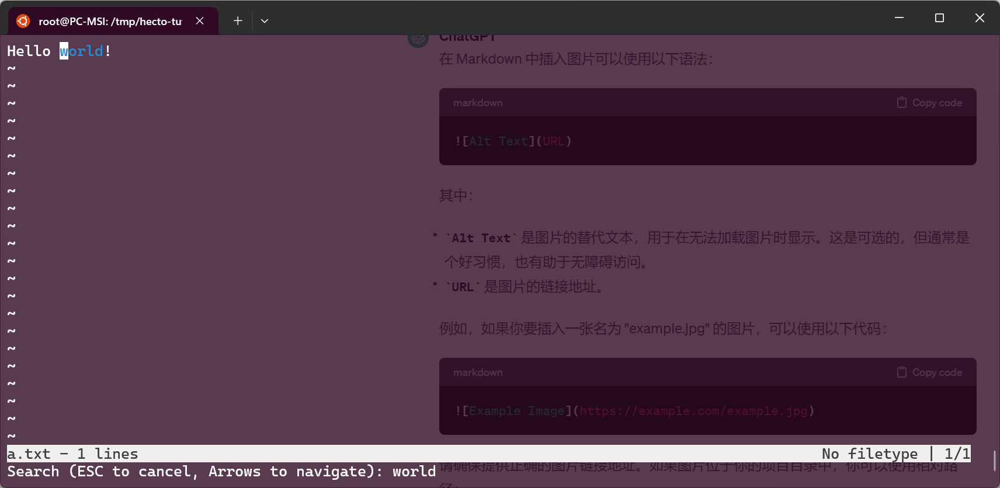

# Hecto
A basic text editor written in Rust!

This is a personal project mainly to learn Rust by implementing a text editor.
I'm follow the Hecto guide written by Philipp Flenker mentioned below in the sources.

---
### Screenshots



---

### Note
The current version of this project is only supported on Linux due to the terminal library.I will improve it to supported Windows in the future.

---

### Compiling and running

1. Make suture You have installed Rust
2. Clone the repository
3. Run these commands
```shell
cd Hecto
cargo build
./target/debug/hecto [file name]
```
---

### Sources

* [Hecto Guide](https://www.philippflenker.com/hecto)
* [VT100 User Guide](http://vt100.net/docs/vt100-ug/chapter3.html)
* [Rust Design Patterns](https://rust-unofficial.github.io/patterns/intro.html)
* [Rust Language Cheat Sheet](https://cheats.rs/)